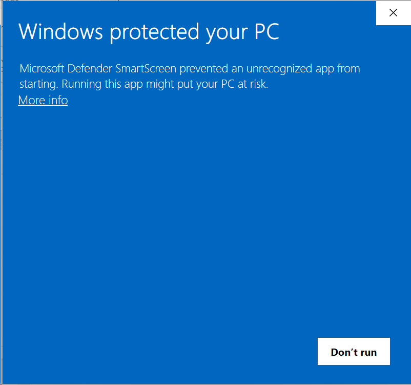

# TermiWeb

TermiWeb is a browser-first shared terminal for a Windows host. It keeps the browser UI as the live interface on the host device and any other device you use to reach it, so one terminal session can continue without remoting the whole desktop.

It was created for power users, especially vibe-coders who want to continue "working" when they need to step away from the desk for a few moments. In other words, it was built for people who want to keep a live shell within reach while moving between their desk and the rest of real life.

## Product Features At A Glance

- Live shared terminals in the browser
- Cross-device attachment to the same live shell
- A Windows installer plus a run surface with start, restart, stop, uninstall, and optional before-sign-in auto-start
- Mobile-oriented terminal controls plus selection/clipboard support
- `0.1.2` adds shell-provided instance titles and a terminal bell, and fixes mobile Select mode dropping out when the phone keyboard changes.
- `0.1` targets Windows hosts only.
- Every shell in `0.1` is elevated.
- `0.1` assumes a trusted Windows machine on a private network.
- WAN exposure is possible, but you are responsible for securing it.

## Download

The public download path for the Windows installer is:

`https://termiweb.com/download/`

The installer is unsigned, so the first time you run it Windows SmartScreen shows "Windows protected your PC". Choose `More info`, then `Run anyway`. Each GitHub release also carries the portable zip as a secondary download for people who prefer a folder they manage themselves.



Repo users can also build both artifacts locally with:

```bash
npm run package:release
```

That command produces the Windows installer, the release folder, and the portable zip under `artifacts/release/`. It needs Inno Setup 6, which `winget install JRSoftware.InnoSetup` provides.

## Installer quick start

1. Run the installer and approve the Windows elevation prompt. If SmartScreen appears, choose `More info`, then `Run anyway`.
2. Choose the TermiWeb password when the installer asks for it. Every browser that connects enters this password.
3. Decide whether TermiWeb should start before anyone signs in. That registers a Windows startup task running as `SYSTEM`; no Windows account password is requested.
4. Let the finish page start TermiWeb and open `http://127.0.0.1:22443`.
5. From another device on the same LAN, browse to the host's LAN URL. The installer already allowed the port through the Windows firewall on every network profile.

The installer places binaries under `%ProgramFiles%\TermiWeb` and keeps config and workspace state under `%ProgramData%\TermiWeb`, where `.env` lives. The Start Menu group offers Open, Start, Restart, Stop, Enable Auto Start, and Disable Auto Start. Uninstall from Apps & Features; the uninstaller asks whether to remove the ProgramData config and state too and keeps them by default.

## Portable zip quick start

The zip keeps its config and state inside its own folder:

1. Unpack it into a user-writable folder.
2. Open `1.Start-Here.md`. It walks through the rest of the setup path.
3. Run `Set Up TermiWeb.cmd` if you want the guided setup path.
4. Approve the Windows elevation prompt when TermiWeb starts.
5. Open `http://127.0.0.1:22443` if setup does not open it for you.

Moving from the zip to the installer: copy the zip folder's `.env` and `.termiweb` folder into `%ProgramData%\TermiWeb`, run the zip's `Uninstall TermiWeb.cmd`, then run the installer. It keeps the copied password and workspace state and skips the password page.

## What `0.1` supports

- Shared terminal instances through the browser UI
- Shell-provided instance titles with stable numbered fallbacks
- A Windows installer plus a run surface with start, restart, stop, uninstall, and optional before-sign-in auto-start
- Elevated-only shell launch path for `0.1`
- One configured app password for local and LAN use
- Authenticated browser sessions that survive normal server restarts until logout or expiry
- Cross-device attachment to the same live shell
- Mobile-oriented terminal controls plus selection/copy support
- Per-instance shared width (as column counts) with `80` as the default for new instances
- A terminal bell with visual alerts and attention badges, plus an optional sound, off by default, that also vibrates on phones
- Clipboard controls, including a fallback paste field when direct browser paste is blocked

## Constraints

- TermiWeb does not currently ship multi-user auth.
- TermiWeb does not currently ship built-in TLS termination.
- TermiWeb does not currently ship a turnkey public-exposure workflow.
- `0.1` is a trusted-network-first product release, not a whole secure remote-access stack by itself.

## Built with

TermiWeb stands on strong existing work, especially `xterm.js`, `node-pty`, TypeScript, Vite, Express, and the Windows terminal stack they make usable from the browser.

## Repo quick start

1. Copy `.env.example` to `.env`.
2. Set `TERMIWEB_PASSWORD` to the value you want before first run.
3. Install dependencies with `npm install`.
4. Start the app with `npm run dev`.
   Windows will request elevation because `0.1` runs elevated shells only.
5. Open `http://127.0.0.1:22443`.

## Running Two Copies On One Machine

- Keep `.env.example` as the product-default config for packaged or single-copy use.
- If you want a repo checkout to run beside another local TermiWeb copy, start that checkout from `.env.dev.example` instead of `.env.example`.
- `.env.dev.example` moves the repo checkout to port `32443`, which keeps it off the product default port.
- Nondefault ports automatically get a matching session-cookie name, so browser login state does not bleed between the two copies.
- Optional before-sign-in auto-start uses a matching port-derived Task Scheduler name too, so the packaged default and a repo checkout do not fight over one startup-task registration when both keep their supported ports.
- The install-time firewall rule follows the same port-derived naming, so two copies on different ports get separate rules.
- Set `TERMIWEB_SESSION_COOKIE_NAME` explicitly only if you need a custom cookie name instead of the port-based default.

## LAN Access

- TermiWeb binds to your LAN by default.
- On the first LAN-bound launch, Windows may show a firewall prompt for the Node-hosted server process.
- Allow access at that prompt if you want phones or other devices on the same LAN to reach TermiWeb. Windows classifies most home networks as Public, so do not limit the allowance to private networks.
- Leave `TERMIWEB_HOST` blank unless you want an explicit bind address.
- Browse to `http://<your-pc-lan-ip>:22443` from another device, such as your phone, on the same network.

## Advanced deployments

- The supported default is still a trusted private network.
- If you want remote access across the internet or across sites, expose it deliberately behind controls you already trust, such as TLS termination, external auth, a reverse proxy, a VPN or mesh network, IP restrictions, or equivalent safeguards.
- Those are real deployment patterns for `0.1`, but they are operator-managed patterns around the app rather than built-in product features.
- The configured app password is part of the access story, not the whole WAN hardening story by itself.

## Scripts

- `npm run dev` starts the integrated dev server and relaunches elevated on Windows when needed.
- `npm run build` builds the client and server output into `dist/`.
- `npm run dev:site` starts the single-page release-site dev server from `src/site`.
- `npm run build:site` builds the GitHub Pages site output into `dist/site`.
- `npm run start` runs the production server from `dist/` and relaunches elevated on Windows when needed.
- `npm run start:hidden` starts the built Windows server in the background without spawning an extra console window and requests elevation when needed.
- `npm run restart:hidden` restarts that hidden Windows background server and requests elevation when needed.
- `npm run stop:hidden` stops that hidden Windows background server and requests elevation when needed.
- `npm run notices:third-party` regenerates `THIRD_PARTY_NOTICES.md` from the installed production dependency graph.
- `npm run package:release` assembles the Windows installer, the release folder, and the portable zip under `artifacts/release/`. It needs Inno Setup 6.
- `npm run typecheck` runs both client and server TypeScript checks.
- `npm test` runs the local test suite.
- `npm run lint` runs the repo lint rules.
- `Set Up TermiWeb.cmd` is the lightweight packaged setup flow: it creates `.env` if needed, prompts for the app password when still unset, offers before-sign-in auto-start, and can start the app for you.
- `Enable TermiWeb Auto Start.cmd` and `Disable TermiWeb Auto Start.cmd` manage the optional before-sign-in startup task for this copy of TermiWeb.
- `Start TermiWeb.cmd`, `Restart TermiWeb.cmd`, and `Stop TermiWeb.cmd` are the Windows launchers intended for the packaged run surface and also work from a built repo checkout. They request elevation because `0.1` runs elevated shells only.
- `Uninstall TermiWeb.cmd` is the portable-zip uninstall entry point and intentionally refuses to run from a source checkout. Installer users uninstall from Apps & Features instead.
- `scripts/set-firewall-rule.ps1` adds the firewall rule for this copy's port on every network profile, or removes it with `-Remove`. The installer runs it; zip users can run it to skip the first-launch firewall prompt.

## Additional Info

- [Developer project plan](docs/PLAN.md)
- [Disclaimer](DISCLAIMER.md)
- [Start-here guide](1.Start-Here.md)
- [Third-party notices](THIRD_PARTY_NOTICES.md)

## Shell behavior

`v0.1` prefers PowerShell 7 from `PATH`, then falls back to the standard install path at `C:\Program Files\PowerShell\7\pwsh.exe`, and only then falls back to Windows PowerShell.

New instances open in the running account's home directory. Set `TERMIWEB_START_DIRECTORY` in `.env` to start them somewhere else, for example your own profile folder when TermiWeb auto-starts as `SYSTEM`. A path that does not exist is ignored.

Two features can be switched off in `.env` for troubleshooting: `TERMIWEB_BELL=false` stops bell detection, bell alerts, and attention badges; `TERMIWEB_SHELL_TITLES=false` stops shell-provided titles from replacing the default instance names. Restart the server after changing either.
